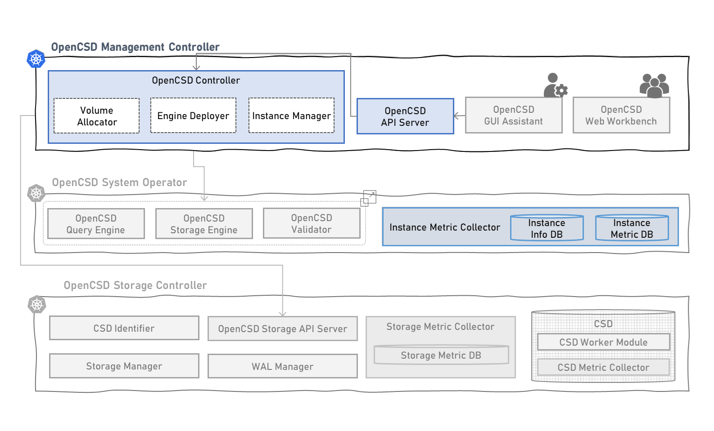

# Introduction of Deployment for OpenCSD Management Controller
-------------

This is yaml files and scripts for opencsd management controller deployment.

Developed by KETI



## Contents
-------------
[1. Requirement](#requirement)

[2. Node Requirement](#node-requirement)

[3. How To Run](#module-description-and-how-to-run-pod)

[4. How To Debug](#how-to-debug)

[5. Governance](#governance)


## Requirement
>   kubernetes 1.26 <br>
>   containerd 1.6.21 <br>
>   go 1.22.1 <br>

## Node Requirement
### Management Node Requirement
```bash
kubectl label nodes management-master key=master
kubectl label nodes management-master layer=management
kubectl label nodes management-master node-role.kubernetes.io/master=
```
### Operation Node Requirement
```bash
kubectl label nodes operator-node key=worker
kubectl label nodes operator-node layer=operator
kubectl label node operator-node node-role.kubernetes.io/worker=
```

## Module Description And How To Run Pod
```bash
git clone https://github.com/opencsd/OpenCSD-Management-Controller
cd OpenCSD-Management-Controller
```
### OpenCSD API Server
Provides API for performing queries and management cluster in OpenCSD Instance
- Instance Management API
- Volume Management API
- Cluster Montiroing API
```bash
cd OpenCSD-API-Server
./1.build.sh
./2.opencsd-api-server.sh
```
### OpenCSD Controller
Manage and monitor instances within OpenCSD and receive and execute instance creation requests.
- Instance Management API
- Volume Management API
```bash
cd OpenCSD-Controller
./1.build.sh
./2.opencsd-controller.sh
```

### OpenCSD Instance Metric Collector
Run a DB that can collect metrics of operation nodes and store query execution logs of opencsd instances.
```bash
cd Instance-Metric-Collector
./1.build.sh
./2.instance-metric-collector.sh
```

```bash
kubectl get pods -n management-controller
```
```bash
NAMESPACE               NAME                                        READY   STATUS    RESTARTS         
management-controller   instance-metric-collector-r5shr             3/3     Running   0                30d
management-controller   opencsd-api-server-65df5d77f6-mhjwm         1/1     Running   0                14d
management-controller   opencsd-controller-688fb455dd-cr4rf         1/1     Running   0                14d
management-controller   opencsd-gui-assistant-87bd5b964-2dknn       1/1     Running   0                29d
management-controller   opencsd-web-workbench-74d7d5645d-prwhc      1/1     Running   0                15d         
```

## How To Debug
```bash
./debug.sh a
./debug.sh e
```


## Governance
This work was supported by Institute of Information & communications Technology Planning & Evaluation (IITP) grant funded by the Korea government(MSIT) (No.2021-0-00862, Development of DBMS storage engine technology to minimize massive data movement)

